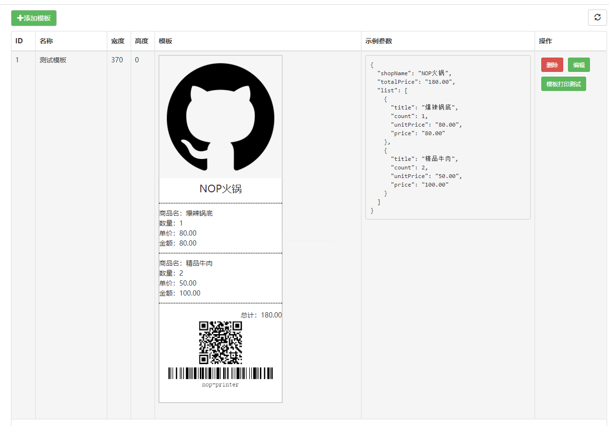

# 用于小票打印，目前适用于Window（Windows 7、Windows 10）
    是一个小票打印的Api服务，使用php的mike42/escpos-php库。
    内容部包含一个独立解压版的php7.3.4,不需另行安装php环境

# 使用方法

## 安装服务
- 下载源码的zip包
- 解压源码包
- 运行 quick-start.bat（打开配置页） 或 printer-start.bat（不打开配置页）

## 配置页（或使用下面的接口调用进行配置）
- 安装后，会自动启动服务，并打开打印配置页面
- 打印配置页URL : http://localhost:8077/printer-setting
- 配置页：

- 打印效果：


- 配置页说明
```
在操作之前，请先在安装好小票打印机及驱动。

1.添加打印机：选择安装的小票打印机，点击“+”号
如果列表内为空，则新添加的打印机会成为默认打印机。
注意:“虚拟打印机”是无法添加的

2.点击打印测试页，会跳转到预览页，点击右侧，打印按钮。
```

## 从接口进行配置
- 获取所有打印机
```
GET http://localhost:8077/api/printer/get-local-printers
```

- 配置添加的小票打印机
```$xslt
POST http://localhost:8077/api/printer/set-printer-config
参数：JSON
{"printer_name":"POS-58","is_default":true}
```

- 设置默认打印机
```$xslt
POST http://localhost:8077/api/printer/set-defult-printer
参数：JSON
{"printer_name":"POS-58"}
```

## 使用图片打印

- 因为各种小票打印机支持的功能差异太大，所有就只实现图片打印，市场上80%的小票打印机都支持图片。
- 测试页就是使用html转canvas图片进行打印的

```
POST http://localhost:8077/api/job/print-image-data-url
参数：JSON
printer_name: 可以不传或为空，则使用默认打印机
{"printer_name":"POS-58","image_data":"data:image/png;base64,..."}

```
## 二维码和条形码支持
在使用HTML或HTML模板打印时可使用class qrcode和barcode 对二维码条形码进行标记
二维码和条形码的更多参数配置，可以通过节点data属性进行传递
```
示例:
二维码： 内容： https://gitee.com/wuxue107/
二维码的更多属性参考： https://github.com/davidshimjs/qrcodejs
<div class="qrcode center" data-widht=128 data-height=128 data-color-light="#ffffff" data-color-dark="#000000" data-text="https://gitee.com/wuxue107/">
条形码： 内容： nop-printer
二维码的更多属性参考： https://lindell.me/JsBarcode/
<div class="barcode" data-format="pharmacode" data-display-value=false data-width=4 data-height=60 data-text="nop-printer">

```
## 使用HTML打印
```
http://127.0.0.1:8077/api/job/print-html
请求：POST-JSON:
{"html":"<p>HELLO NOP</p>","printer_name":null}
响应：
{
"code": 0,
"msg": "操作成功",
"data": {
"task_id": 14
}
}
```


## 使用HTML模板打印
```
http://127.0.0.1:8077/api/job/print-tpl
请求：POST-JSON:
{"printer_name":null,"tpl_name":"simple-tpl","tpl_params":{"user":"NOP"}}
响应：
{
"code": 0,
"msg": "操作成功",
"data": {
"task_id": 14
}
}
```

## HTML打印模板管理 
- 模板采用lodash template 模板语法


### 保存模板（模板名不存在则创建）
```
http://127.0.0.1:8077/api/print-tpl/save
请求：POST-JSON:
{"attrs":{"tpl_name":"simple-tpl","tpl_content":"<p>HELLO <%=user%></p>","params_examples":"{\"user\":\"WORLD\"}"}}
响应：
{
"code": 0,
"msg": "操作成功",
"data": {
"tpl_name": "simple-tpl",
"tpl_content": "<p>HELLO <%=user%></p>",
"params_examples": "{\"user\":\"WORLD\"}",
"updated_at": "2021-02-19T16:49:38.000000Z",
"created_at": "2021-02-19T16:49:38.000000Z",
"id": 2
}
}
```
### 查询模板
```
http://127.0.0.1:8077/api/print-tpl/get
请求：POST-JSON:
{"tpl_name":"simple-tpl"}
响应：
"data": {
"tpl_name": "simple-tpl",
"tpl_content": "<p>HELLO <%=user%></p>",
"params_examples": "{\"user\":\"WORLD\"}",
"updated_at": "2021-02-19T16:49:38.000000Z",
"created_at": "2021-02-19T16:49:38.000000Z",
"id": 2
}
}
```
### 删除模板
```
http://127.0.0.1:8077/api/print-tpl/delete
请求：POST-JSON:
{"tpl_name":"simple-tpl"}
响应：
{
"code": 0,
"msg": "操作成功",
"data": null
}
```

## 清理打印缓存
```$xslt
POST http://localhost:8077/api/printer/clear-cache
参数：JSON
{}
响应：
{
"code": 0,
"msg": "操作成功",
"data": null
}
```

## 启动服务
    运行:printer-start.bat

## 停止服务
    运行:printer-stop.bat

## 注册系统服务启动项
    运行:system-service register
    
## 注销系统服务启动项
    运行:system-service unregister


