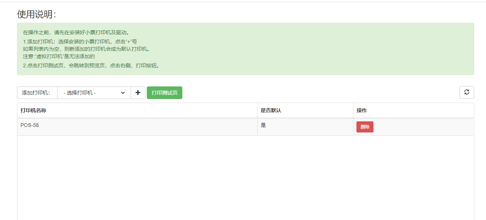

# 用于小票打印，目前只适用于Window
    小票打印,接口无交互。
## 启动项目
运行：start.bat

## 打开打印机配置页（或使用下面的接口调用进行配置）


- http://localhost:8077/printer-setting



- 配置页说明
```
在操作之前，请先在安装好小票打印机及驱动。

1.添加打印机：选择安装的小票打印机，点击“+”号
如果列表内为空，则新添加的打印机会成为默认打印机。
注意:“虚拟打印机”是无法添加的

2.点击打印测试页，会跳转到预览页，点击右侧，打印按钮。
```


- 获取所有打印机
```
GET http://localhost:8077/api/printer/get-local-printers
```


- 配置添加的小票打印机
```$xslt
POST http://localhost:8077/api/printer/set-printer
参数：JSON
{"printer_name":"POS-58","is_default":true}
```


- 打印一张图片
因为各种小票打印机支持的功能差异太大，所有就只实现图片打印，市场上80%的小票打印机都支持图片。
测试页就是使用html转canvas图片进行打印的

```
POST http://localhost:8077/api/job/print-image-data-url
参数：JSON
printer_name: 可以不传或为空，则使用默认打印机
{"printer_name":"POS-58","image_data":"data:image/png;base64,..."}
```


